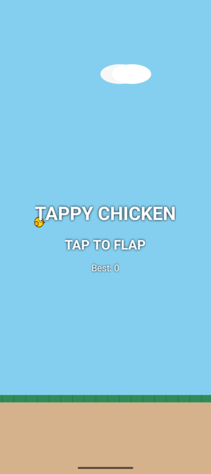
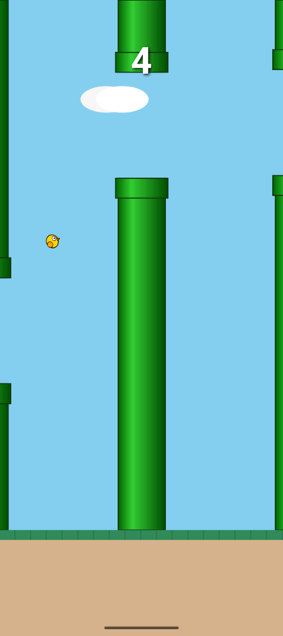
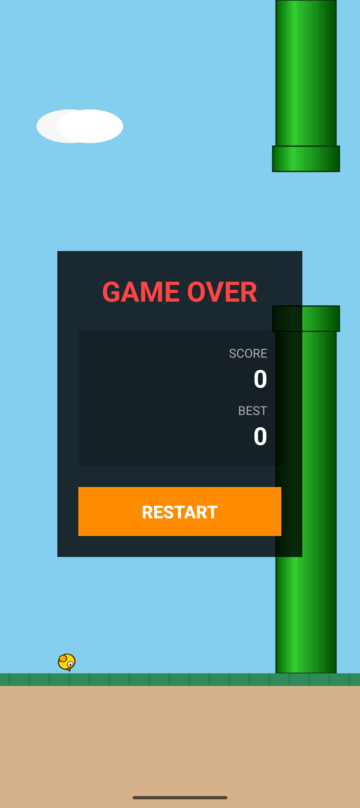

# Tappy Chicken

A Flappy Bird–style Android game built with Kotlin and `SurfaceView`.

| Ready | Playing | Game Over |
|-------|---------|-----------|
|  |  |  |

## Gameplay

Tap the screen to flap. Navigate through procedurally generated pipe gaps. Each gap passed scores one point. Colliding with a pipe or the ground ends the run. High scores persist across sessions.

### States

- **READY** – chicken idles, background scrolls, tap to start
- **PLAYING** – full physics (gravity 3200 u/s², flap impulse −900 u/s), pipes scroll at −350 u/s, scoring active
- **DEAD** – collision occurred, chicken falls to ground, input ignored
- **GAME\_OVER** – scoreboard with medal (bronze ≥ 10, silver ≥ 20, gold ≥ 40), restart resets everything except high score

## Architecture

```
SurfaceView + GameThread (dedicated loop)
├── Physics          – virtual 1080×1920 coordinate space, delta‑time clamped to 0.1 s
├── Rendering        – VectorDrawableCompat → Bitmap cache, blitted per frame
├── Pipes            – 3 active pairs, recycled with random gap center [350…1250]
├── Collision        – AABB with 12 % chicken hitbox padding (55×55 vs 70×70 visual)
├── Scoring          – SharedPreferences ("tappy_chicken_prefs")
├── Audio            – SoundPool (4 streams, USAGE_GAME)
└── State machine    – READY → PLAYING → DEAD → GAME_OVER
```

## Tech Stack

| Component | Choice |
|-----------|--------|
| Language  | Kotlin 2.0 (K2 compiler) |
| Min SDK   | 26 (Android 8.0) |
| Target SDK| 35 (Android 15) |
| Build     | Gradle 8.7 + AGP 8.5.2 |
| Rendering | SurfaceView + Canvas |
| Vectors   | VectorDrawableCompat → Bitmap cache |
| Audio     | SoundPool (OGG, 44.1 kHz mono) |
| Persistence | SharedPreferences |

## Building

```bash
./gradlew assembleDebug
./gradlew lintDebug
```

## License

See [LICENSE](LICENSE).
